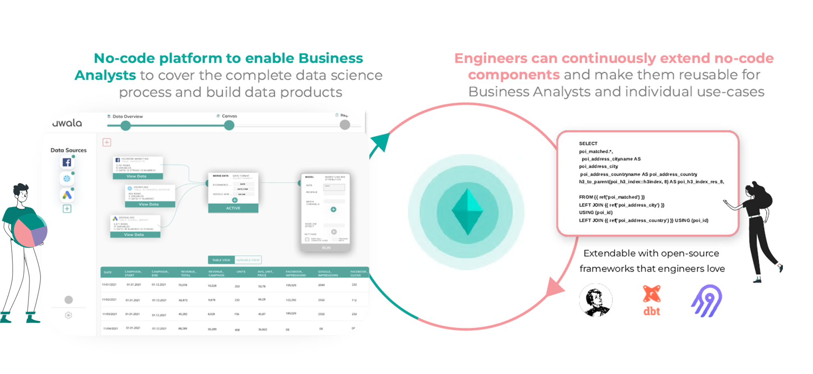

[](https://join.slack.com/t/kuwala-community/shared_invite/zt-l5b2yjfp-pXKFBjbnl7_P3nXtwca5ag)


<p align="center">
  <a href="https://join.slack.com/t/kuwala-community/shared_invite/zt-l5b2yjfp-pXKFBjbnl7_P3nXtwca5ag"></a>
  <a href="https://github.com/orgs/kuwala-io/projects/3/views/6"></a>
</p>

Kuwala is **the no-code data platform for BI analysts and engineers enabling you to build powerful analytics workflows.** 
We are set out to bring **state-of-the-art data engineering tools** you love, such as 
[Airbyte](https://github.com/airbytehq/airbyte), [dbt](https://github.com/dbt-labs/dbt-core), or 
[Great Expectations](https://github.com/great-expectations/great_expectations) together in one intuitive interface built 
with [React Flow](https://github.com/wbkd/react-flow).

Do you want to **discuss your first contribution**, want to **learn more in general**, or 
**discuss your specific use-case** for Kuwala? Just **book a digital coffee session** with the core team 
[here](https://calendly.com/kuwala_io/kuwala-community-chat).



Kuwala stands for **extendability, reproducibility, and enablement**. Small data teams build data products fastly and 
collaboratively. Analysts and engineers stay with their strengths. Kuwala  is the tool that makes it possible to keep a 
data project within scope while having fun again.

- **Kuwala Canvas runs directly on a data warehouse** = Maximum flexibility and no lock-in effect
- **Engineers enable their analysts** by adding transformations and models via dbt or new data sources through Airbyte
- **The node-based editor enables analyst** to build advanced data workflows with many data sources and transformations through simple drag-and-drop
- **With models-as-a-block** the BI analyst can launch advanced Marketing Mix Models and attributions without knowing R or Python


### Extract and Load with Airbyte

For connecting and loading all your tooling data into a data warehouse, we are integrating with Airbyte connectors. For
everything related to third-party data, such as POI and demographics data, we are building separate data pipelines.

### Transform with dbt

To apply transformations on your data, we are integrating dbt which is running on top of your data warehouses. Engineers 
can easily create dbt models and make them reusable to the frontend.

### Run a Data Science Model

We are going to include open-source data science and AI models (e.g., [
Meta's Robyn Marketing Mix Modeling](https://github.com/facebookexperimental/Robyn)).

### Report

We make the results exportable to Google Sheets and in the future also available in a Medium-style markdown editor.

---

# How can I use Kuwala?

### Canvas

The canvas environment is currently WIP. But you can already get an idea of how it is going to look like with our
[prototype](https://www.figma.com/proto/Dbpnc4yGV19ppRhr9k5BsU/Kuwala_UI?node-id=1494%3A112067&scaling=scale-down-width&starting-point-node-id=1494%3A112067)
and checkout our [roadmap]() for updates.

### Third-party data connectors

We currently have five pipelines for different third-party data sources which can easily be imported into a Postgres 
database. The following pipelines are integrated:

 - [Admin Boundaries](https://github.com/kuwala-io/kuwala/tree/master/kuwala/pipelines/admin-boundaries/README.md)
 - [Google POIs](https://github.com/kuwala-io/kuwala/tree/master/kuwala/pipelines/google-poi/README.md)
 - [Google Trends](https://github.com/kuwala-io/kuwala/tree/master/kuwala/pipelines/google-trends/README.md)
 - [OSM POIs](https://github.com/kuwala-io/kuwala/tree/master/kuwala/pipelines/osm-poi/README.md)
 - [Population Density](https://github.com/kuwala-io/kuwala/tree/master/kuwala/pipelines/population-density/README.md)

### Jupyter environment & CLI

Before the canvas is built, we have a Jupyter environment with convenience functions to work with the third-party data 
pipelines. To easily run the data pipelines, you can use the CLI.

#### Quickstart & Demo

##### *Demo correlating Uber traversals with Google popularities*

[![badge](https://img.shields.io/badge/launch-demo-579ACA.svg?logo=)](https://mybinder.org/v2/gh/kuwala-io/kuwala_examples/1def41ded01dbb67ecada9dc227c834cd93d0721?urlpath=lab%2Ftree%2Fnotebooks%2F1.%20Popularity%20Correlation.ipynb)


We have a notebook with which you can correlate any value associated with a geo-reference with the Google popularity 
score. In the demo, we have preprocessed popularity data and a test dataset with Uber rides in Lisbon, Portugal.

#### Run the demo

You could either use the deployed example on Binder using the badge above or run everything locally. The Binder example
simply uses Pandas dataframes and is not connecting to a data warehouse. 

<details>
    <summary>Setting up and running the CLI</summary><br/>

#### Prerequisites

1. Installed version of `Docker` and `docker-compose v2`.
   - We recommend using the latest version of [`Docker Desktop`](https://www.docker.com/products/docker-desktop).
2. Installed version of `Python3`.
   - We recommend using version `3.9.5` or higher.
   - To check your current version run `python3 --version`.
3. Installed version of `libpq`.
   - For Mac, you can use brew: `brew install libpq`

#### Setup

1. Change your directory to `kuwala/core/cli`.
2. Create a virtual environment.
   - For instructions on how to set up a `venv` on different system see [here](https://packaging.python.org/en/latest/guides/installing-using-pip-and-virtual-environments/).
3. Install dependencies by running `pip3 install --no-cache-dir -r requirements.txt`

#### Run

To start the CLI, run the following command from inside the `kuwala/core/cli/src` directory and follow the instructions:

```zsh
python3 main.py
```

</details>

### Using Kuwala components individually

To use Kuwala's components, such as the data pipelines or the Jupyter environment, individually, please refer to the
[instructions under `/kuwala`](https://github.com/kuwala-io/kuwala/blob/master/kuwala/README.md).

---

# Use cases

- [How to build an Uber-like analytics system with Kuwala](https://kuwala.io/data-pipelines/how-to-build-an-uber-like-intelligence-system-for-your-new-mobility-startup-without-a-big-data-team/)
- [Perform location analytics for a grocery store with Kuwala](https://kuwala.io/case-studies/why-instant-grocery-delivery-should-follow-a-data-driven-path-like-uber-to-survive-part-1/)
- [Querying the most granular demographics data set with Kuwala](https://kuwala.io/data-pipelines/querying-the-most-granular-demographics-dataset/)

---

# How can I contribute?

Every new issue, question, or comment is a contribution and very welcome! This project lives from your feedback and
involvement!

## Be part of our community

The best first step to get involved is to join the 
[Kuwala Community on Slack](https://join.slack.com/t/kuwala-community/shared_invite/zt-l5b2yjfp-pXKFBjbnl7_P3nXtwca5ag). 
There we discuss everything related to our roadmap, development, and support. 

## Contribute to the project

Please refer to our [contribution guidelines](https://github.com/kuwala-io/kuwala/tree/master/CONTRIBUTING.md) for further information on how to get involved.

---

# Get more content about Kuwala
  Link  | Description    
-------------|-------------
[Blog](https://kuwala.io/blog/) | Read all our blog articles related to the stuff we are doing here. 
[Join Slack](https://join.slack.com/t/kuwala-community/shared_invite/zt-l5b2yjfp-pXKFBjbnl7_P3nXtwca5ag) | Our Slack channel with over 170 data engineers and many discussions.
[Jupyter notebook - Popularity correlation](https://mybinder.org/v2/gh/kuwala-io/kuwala_examples/1def41ded01dbb67ecada9dc227c834cd93d0721?urlpath=lab%2Ftree%2Fnotebooks%2F1.%20Popularity%20Correlation.ipynb) | Open a Jupyter notebook on Binder and merge external popularity data with Uber traversals by making use of convenient dbt functions. 
[Podcast](https://anchor.fm/kuwala-io) | Listen to our community podcast and maybe join us on the next show.
[Digital coffee break](https://calendly.com/kuwala_io/kuwala-community-chat?month=2022-02) | Are you looking for new inspiring tech talks? Book a digital coffee chit-chat with one member of the core team.
[Our roadmap](https://github.com/orgs/kuwala-io/projects/3/views/6) | See our upcoming milestones and sprint planing.
[Contribution guidelines](https://github.com/kuwala-io/kuwala/tree/master/CONTRIBUTING.md) | Further information on how to get involved.
