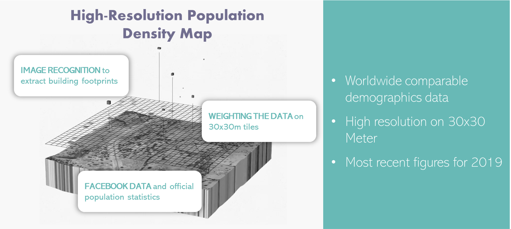
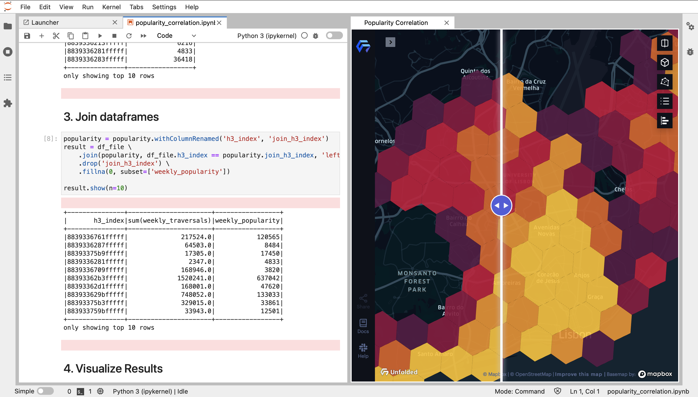

[](
https://join.slack.com/t/kuwala-community/shared_invite/zt-l5b2yjfp-pXKFBjbnl7_P3nXtwca5ag)

## What is Kuwala?

Kuwala is a tool to build rich features for analytics based on clean data. It uses 
[PySpark](http://spark.apache.org/docs/latest/api/python/) in combination with 
[Parquet](http://parquet.apache.org/documentation/latest/) for data processing. Different data sources are connected in 
a Neo4j graph database allowing for fast and flexible feature generation.

## How can I use Kuwala?

There are basically 3 ways you can work with the clean data at the moment:

1. Preprocessed Parquet files
2. Neo4j graph database queries
3. Jupyter notebooks with convenience functions

## Which data pipelines are available right now?

### OpenStreetMap (OSM) POIs

Points of interest are places that are physically accessible. This includes, for example, businesses, restaurants, schools, tourist attractions and parks. 
A complete list of categories and further information can be found in our [OSM documentation](https://github.com/kuwala-io/kuwala/tree/master/kuwala/pipelines/osm-poi). 
We take the daily updated `.pbf` files with the entire data on OSM from [Geofabrik](http://www.geofabrik.de). 
We filter  objects based on tags that are irrelevant for POIs. We then further aggregate the tags to high-level categories 
allowing for easy query building and extract other metadata such as the address, contact details, or the building 
footprint. By extracting and cleaning the data from OpenStreetMap, Kuwala has one of the largest POI databases scalable to any place in the world.

### Google POIs


Kuwala offers a scraper that retrieves all available metadata for POIs as seen on Google Search. You can verify the POIs from OSM and enrich 
them further with an hourly, standardized score for visitation frequency throughout the week.This helps to understand the flow of people throughout a city. 
We do not use the Google Maps API so there is no need for registration. Instead, the results are generated based on search strings 
which can be based on OpenStreetMap (OSM) data. For more information, 
please visit the [complete documentation](https://github.com/kuwala-io/kuwala/tree/master/kuwala/pipelines/google-poi).

### High-Resolution Demographic Data



The high-resolution demographic data comes from Facebook's 
[Data for Good](https://dataforgood.facebook.com/dfg/docs/methodology-high-resolution-population-density-maps) 
initiative. It provides population estimates for the whole world roughly 30 x 30 meters for different demographic groups such as total, 
female, male or youth. It is a statistical model based on official census data combined with Facebook's data and 
satellite images. The demographics data represents the highest granularity and most up to date data of population estimates that is available. 

### H3 (Spatial Index)
H3 is an hierachically ordered indexing method for geo-spatial data which represents the world in unique hexagons of different sizes (bins).
H3 makes it possible to aggregate data fast on different levels and different forms. It is computional efficient for databases and finds application
in weighting data. One example might be weighting less granular data like income data with the high resolution demographics data provided 
through Kuwala. H3 was developed by Uber, for the complete documentation please go to the [H3 Repo](https://github.com/uber/h3)

---

## Quick Start & Demo

#### Prerequisites

Installed version of *Python3*, *Docker* and 
*docker-compose* ([*Go here for instructions*](https://docs.docker.com/compose/install/))

***Note***: We recommend giving Docker at least 8 GB of RAM (On Docker Desktop you can go under settings -> resources)

#### Demo correlating Uber traversals with Google popularities



We have a notebook with which you can correlate any value associated with a geo-reference with the Google popularity 
score. In the demo we have a preprocessed graph and a test dataset with Uber rides in Lisbon, Portugal.

#### Run the demo

Launch Docker in the background and from inside the root directory run:

```zsh 
cd kuwala/scripts && sh initialize_core_components.sh && sh run_cli.sh
```

#### Run the data pipelines yourself

To run the pipelines yourself, build the components first from inside the `kuwala/scripts` directory by executing the 
`initialize_all_components.sh` script and the starting the CLI by running the `run_cli.sh` script.

---

## Using Individual Pipelines

Apart from using the CLI, you can also run the pipelines individually without Docker. For more detailed instructions
please take a look at the [`./kuwala/README.md`](https://github.com/kuwala-io/kuwala/tree/master/kuwala/README.md).

We currently have the following pipelines published:
- [`osm-poi`](https://github.com/kuwala-io/kuwala/tree/master/kuwala/pipelines/osm-poi):
  Global collection of point of interests (POIs)
- [`population-density`](https://github.com/kuwala-io/kuwala/tree/master/kuwala/pipelines/population-density): 
  Detailed population and demographic data
- [`google-poi`](https://github.com/kuwala-io/kuwala/tree/master/kuwala/pipelines/google-poi):
  Scraping API to retrieve POI information from Google (incl. popularity score)

---

## How You Can Contribute

#### Be part of our community

The best first step to get involved is to 
[join](https://join.slack.com/t/kuwala-community/shared_invite/zt-l5b2yjfp-pXKFBjbnl7_P3nXtwca5ag) the Kuwala Community 
on Slack. There we discuss everything related to data integration and new pipelines. Every pipeline will be open-source. 
We entirely decide, based on you, our community, which sources to integrate. You can reach out to us on Slack or 
[email](mailto:community@kuwala.io) to request a new pipeline or contribute yourself. 

#### Contribute to the project

If you want to contribute 
yourself, you can use your choice's programming language and database technology. We have the only requirement that it 
is possible to run the pipeline locally and use [Uber's H3](https://eng.uber.com/h3/) functionality to handle 
geographical transformations. We will then take the responsibility to maintain your pipeline.

*Note: To submit a pull request, please fork the project and then submit a PR to the base repo.*

### Liberating the Work With Data

By working together as a community of data enthusiasts, we can create a network of seamlessly integratable pipelines. 
It is now causing headaches to integrate third-party data into applications. But together, we will make it 
straightforward to combine, merge and enrich data sources for powerful models.

### What's Coming Next For the Pipelines?
Based on the use-cases we have discussed in the community and potential users, we have identified a variety of data 
sources to connect with next:

#### Semi-Structured Data
Already structured data but not adapted to the Kuwala framework:

- Google Trends - https://github.com/GeneralMills/pytrends
- Instascraper - https://github.com/chris-greening/instascrape
- GDELT - https://www.gdeltproject.org/
- Worldwide Administrative boundaries - https://index.okfn.org/dataset/boundaries/
- Worldwide scaled calendar events (e.g. bank holidays, school holidays) - https://github.com/commenthol/date-holidays

#### Unstructured Data
Unstructured data becomes structured data:
- Building Footprints from satellite images

#### Wishlist
Data we would like to integrate, but a scalable approach is still missing:

- Small scale events (e.g., a festival, movie premiere, nightclub events)
